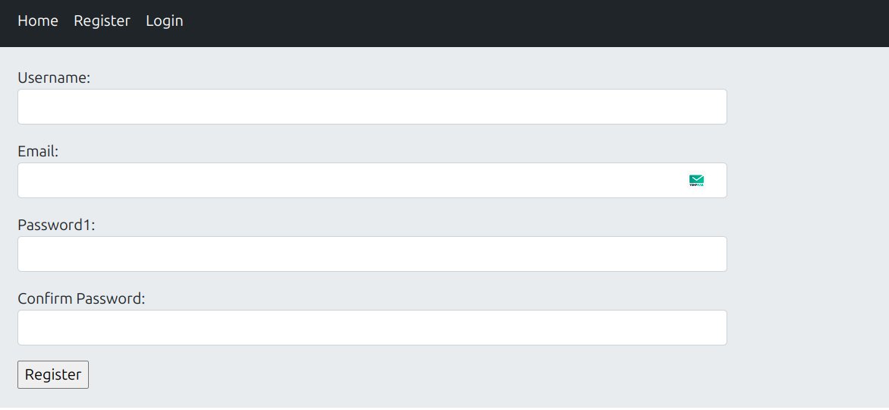
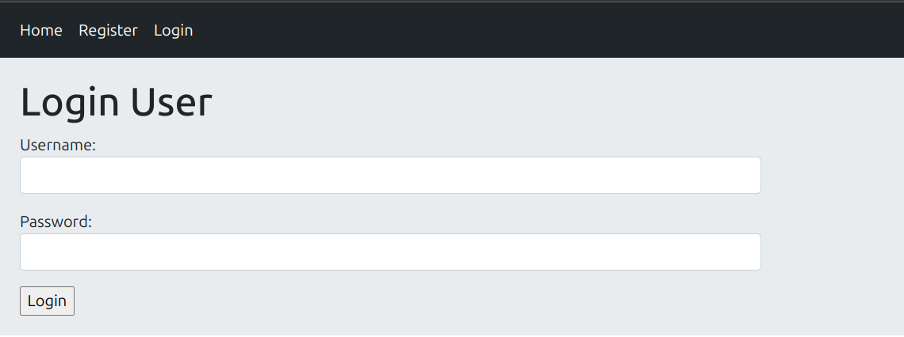
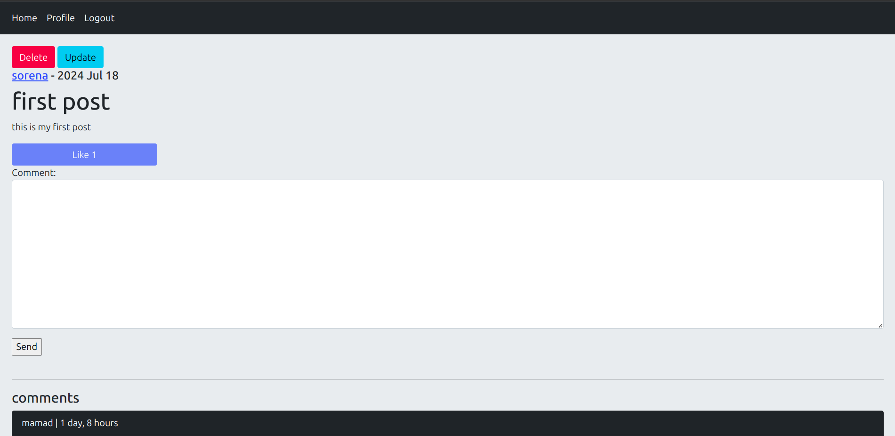
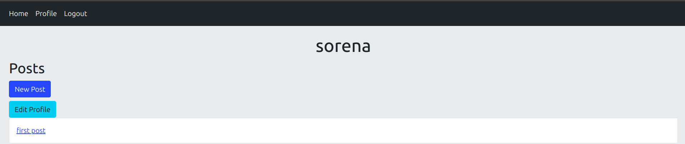

# Django Social Network Project


## Table of Contents
- [Overview](#overview)
- [Features](#features)
- [Installation](#installation)
- [Usage](#usage)
- [Configuration](#configuration)
- [Running the Tests](#running-the-tests)
- [Deployment](#deployment)
- [Contributing](#contributing)
- [License](#license)
- [Contact](#contact)

## Overview
This is a social network application built using Django. Users can register, log in, create posts, view other users' posts, follow other users, like posts, and comment on posts.

## Features
- User Registration and Authentication
- User Profile
- Create, Edit, and Delete Posts
- Follow and Unfollow Users
- Like and Unlike Posts
- Comment on Posts
- View Posts from Followed Users

## Installation

### Prerequisites

- Python 3.x
- Django 5.x
- Virtualenv (optional but recommended)

### Steps

1. **Clone the repository:**

    ```bash
    git clone https://github.com/darkkLUCIFER/simple_social_network.git
    cd your-repo-name
    ```

2. **Create a virtual environment:**

    ```bash
    python -m venv venv
    source venv/bin/activate  # On Windows, use `venv\Scripts\activate`
    ```

3. **Install dependencies:**

    ```bash
    pip install -r requirements.txt
    ```

    4. **Apply migrations:**

    ```bash
    python manage.py migrate
    ```

5. **Create a superuser:**

    ```bash
    python manage.py createsuperuser
    ```

6. **Run the development server:**

    ```bash
    python manage.py runserver
    ```

7. **Open your browser and navigate to:**

    ```url
    http://127.0.0.1:8000
    ```

## Usage

### Register and Login

1. Open the registration page and create a new account.
2. Log in using your credentials(email or username with password).

### Creating Posts

1. Navigate to the post creation page.
2. Enter your post content and submit.

### Following Users

1. Visit another user's profile.
2. Click the "Follow" button to follow the user.

### Liking and Commenting on Posts

1. Browse posts.
2. Click the "Like" button to like a post.
3. Add comments using the comment form.

## Screenshots





## Contributing

Contributions are welcome! Please create a pull request or open an issue to discuss what you would like to change.

1. Fork the Project
2. Create your Feature Branch (`git checkout -b feature/AmazingFeature`)
3. Commit your Changes (`git commit -m 'Add some AmazingFeature'`)
4. Push to the Branch (`git push origin feature/AmazingFeature`)
5. Open a Pull Request

## License

Distributed under the MIT License. See `LICENSE` for more information.
---